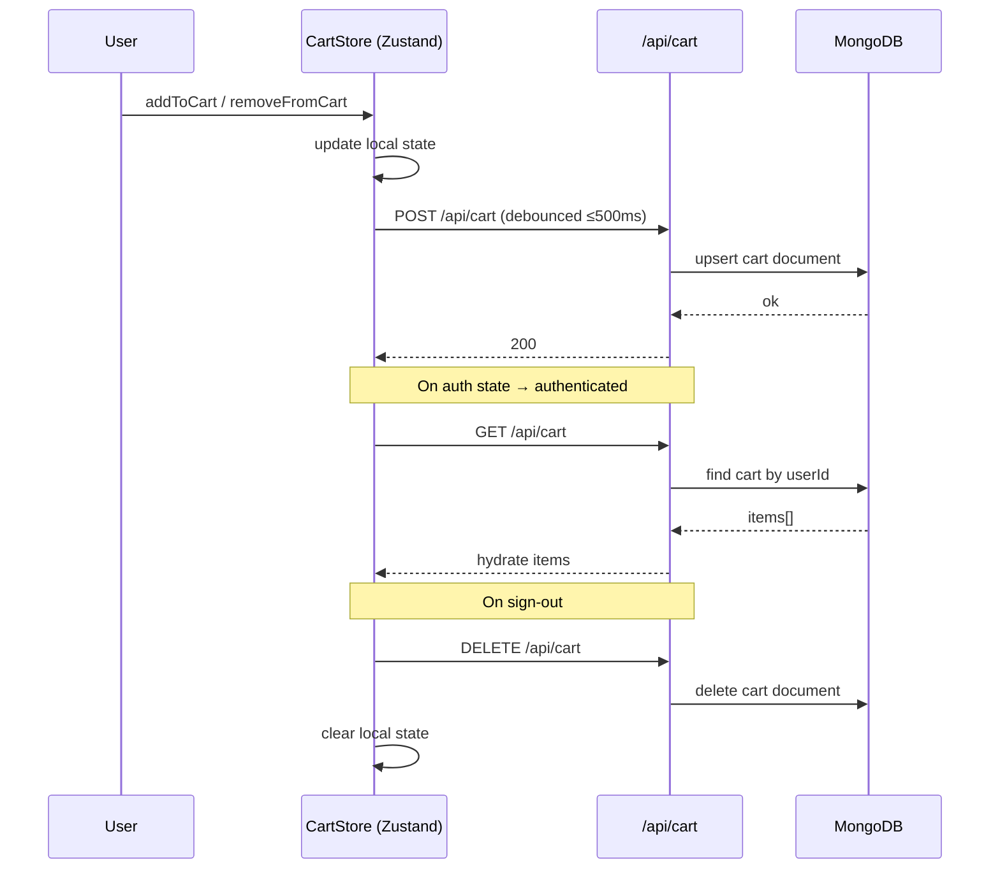

# Design Document — GG Shop Enhancements

## Overview

This document describes the technical design for ten cross-cutting enhancements to the GG Shop Next.js e-commerce application. The changes span security hardening (RBAC, middleware protection), data persistence (server-side cart), developer quality (image config, toast consolidation), user experience (pagination, error boundaries, SEO), accessibility (form labels), and content (static pages).

The application runs on **Next.js 16 App Router** with TypeScript, Tailwind CSS, MongoDB/Mongoose, better-auth, Zustand, react-hot-toast, Stripe, and Cloudinary. All changes are additive or refactoring in nature — no existing data models are dropped.

### Key Design Principles

- **Middleware-first security**: Route protection lives in `middleware.ts` at the Edge, not in client components.
- **Server-authoritative cart**: Zustand remains the client cache; MongoDB is the source of truth for authenticated users.
- **Single toast system**: `react-hot-toast` is already mounted in `app/layout.tsx`; all call sites converge on it.
- **Progressive enhancement**: Unauthenticated users retain full localStorage-based cart; server sync activates on login.

---

## Architecture

```mermaid
graph TD
  subgraph Edge ["Edge (middleware.ts)"]
    MW[Auth Middleware]
  end

  subgraph AppRouter ["Next.js App Router"]
    PL["(page) layout — Nav + Footer"]
    DL["(dashboard) layout — Sidebar + Navbar"]
    PP[Products Page]
    PDP[Product Detail Page]
    SP[Static Pages /contact /shipping /faq /privacy /terms]
    EB[ProductErrorBoundary]
  end

  subgraph API ["API Routes"]
    PA["/api/products?page&limit"]
    CA["/api/cart GET/POST/DELETE"]
    AUTH["/api/auth/[...all]"]
  end

  subgraph Client ["Client Layer"]
    CS[Zustand CartStore]
    TH[react-hot-toast Toaster]
  end

  subgraph DB ["MongoDB"]
    PM[(Products)]
    CM[(Carts)]
    UM[(Users — better-auth)]
  end

  MW -->|admin → next()| DL
  MW -->|no session → /sign-in| PL
  MW -->|user role → /| PL

  PL --> PP
  PL --> PDP
  PL --> SP
  PP --> EB
  PDP --> EB

  PP --> PA
  PA --> PM
  CA --> CM
  CS -->|POST/DELETE| CA
  CS -->|GET on auth| CA
  AUTH --> UM
```

### Data Flow: Cart Persistence



---

## Components and Interfaces

### 1. Middleware (`middleware.ts`)

Replaces the existing `proxy.ts` stub. Runs on the Next.js Edge Runtime.

```typescript
// middleware.ts
import { NextRequest, NextResponse } from 'next/server';
import { auth } from '@/lib/auth';

const PROTECTED_PATHS = ['/dashboard', '/add-product', '/all-products', '/edit-product'];

export async function middleware(request: NextRequest) {
  const { pathname } = request.nextUrl;
  const isProtected = PROTECTED_PATHS.some(p => pathname.startsWith(p));
  if (!isProtected) return NextResponse.next();

  const session = await auth.api.getSession({ headers: request.headers });

  if (!session) {
    return NextResponse.redirect(new URL('/sign-in', request.url));
  }

  const role = (session.user as any).role as string;
  if (role !== 'admin') {
    return NextResponse.redirect(new URL('/', request.url));
  }

  return NextResponse.next();
}

export const config = {
  matcher: ['/dashboard', '/add-product', '/all-products', '/edit-product/:path*'],
};
```

**Interface contract:**
- Input: `NextRequest` with optional session cookie
- Output: `NextResponse` — redirect to `/sign-in`, redirect to `/`, or `next()`
- Session read via `auth.api.getSession` (better-auth server API, not cookie inspection)

---

### 2. Cart Mongoose Model (`lib/modals/Cart.ts`)

New model to persist per-user cart state.

```typescript
interface CartItem {
  id: string;       // product _id as string
  name: string;
  image: string;
  price: number;
  quantity: number;
}

interface CartDocument {
  userId: string;   // better-auth user id
  items: CartItem[];
  updatedAt: Date;
}
```

Schema uses `{ userId: { type: String, required: true, unique: true } }` with an index on `userId` for O(1) lookups.

---

### 3. Cart API Routes (`app/api/cart/route.ts`)

Three handlers on a single route file:

| Method | Behaviour |
|--------|-----------|
| `GET` | Returns `{ items: CartItem[] }` for the authenticated user. Returns `{ items: [] }` if no cart document exists. |
| `POST` | Body: `{ items: CartItem[] }`. Upserts the cart document (replaces items array). Returns `{ ok: true }`. |
| `DELETE` | Deletes the cart document for the authenticated user. Returns `{ ok: true }`. |

All three handlers:
1. Call `auth.api.getSession` to verify authentication.
2. Return `401` if no session.
3. Use `userId` from `session.user.id` as the lookup key.

---

### 4. Zustand CartStore — Server Sync Extension (`store/cartStore.ts`)

The existing store is extended with three new async actions and a debounce timer ref:

```typescript
interface CartState {
  // existing fields ...
  syncStatus: 'idle' | 'syncing' | 'error';
  syncWithServer: () => Promise<void>;      // GET /api/cart → hydrate
  pushToServer: () => Promise<void>;        // POST /api/cart with current items
  clearFromServer: () => Promise<void>;     // DELETE /api/cart
}
```

**`setUserId` extension**: When `status` transitions to `'authenticated'`, call `syncWithServer()` to hydrate from the server. This replaces the current no-op for the authenticated case.

**Debounce**: `addToCart`, `removeFromCart`, `decreaseQuantity`, and `clearCart` each schedule `pushToServer()` via a 400ms debounce (well within the 500ms requirement). The debounce timer is stored in a module-level `ref` outside Zustand state to avoid re-renders.

**Unauthenticated guard**: `pushToServer` and `clearFromServer` check `get().userId` before making any fetch call. If `userId` is null, they return immediately.

---

### 5. ProductErrorBoundary (`components/ProductErrorBoundary.tsx`)

React class component (required for `componentDidCatch`):

```typescript
interface State { hasError: boolean; error: Error | null }

class ProductErrorBoundary extends React.Component<
  { children: React.ReactNode; fallback?: React.ReactNode },
  State
> {
  static getDerivedStateFromError(error: Error): State
  componentDidCatch(error: Error, info: React.ErrorInfo): void  // console.error
  render(): React.ReactNode  // children or fallback UI
}
```

Default fallback UI: a centered card with the message "Some products could not be loaded. Please try refreshing the page." styled to match the existing `#F9F4F5` background aesthetic.

**Usage sites:**
- `app/(page)/products/page.tsx` — wraps `<ProductList />`
- `app/(page)/products/[productId]/page.tsx` — wraps `<ProductDetailsClient />`

---

### 6. Pagination — API Layer

`GET /api/products` gains two optional query parameters:

| Param | Default | Validation |
|-------|---------|------------|
| `page` | `1` | integer ≥ 1 |
| `limit` | `12` | integer 1–100 |

Response shape changes from `Product[]` to:

```typescript
interface PaginatedProductsResponse {
  products: Product[];
  totalCount: number;
  page: number;
  totalPages: number;
}
```

MongoDB query: `Product.find(filter).skip((page-1)*limit).limit(limit)` with a parallel `Product.countDocuments(filter)` call.

---

### 7. Pagination — UI Layer (`components/Pagination.tsx`)

New client component:

```typescript
interface PaginationProps {
  currentPage: number;
  totalPages: number;
  onPageChange: (page: number) => void;
}
```

Renders: Previous button, page number buttons (with ellipsis for large ranges), Next button. Each button has `aria-label="Go to page N"` and `aria-current="page"` on the active page. Keyboard navigation is native via `<button>` elements.

**Integration**: `app/(page)/products/page.tsx` becomes a Server Component that reads `searchParams.page`, fetches the paginated API response, and passes `totalPages` + `currentPage` to `<Pagination>`. Page changes update the URL via `router.push` with the new `?page=N` param, which triggers a server re-render and scrolls to top via `window.scrollTo(0, 0)` in a `useEffect`.

---

### 8. Image Configuration (`next.config.ts`)

Migrates from deprecated `images.domains` to `images.remotePatterns`:

```typescript
images: {
  remotePatterns: [
    { protocol: 'https', hostname: 'res.cloudinary.com' },
    { protocol: 'https', hostname: 'lh3.googleusercontent.com' },
    { protocol: 'https', hostname: 'fakestoreapi.com' },
    { protocol: 'https', hostname: 'unsplash.com' },
  ],
}
```

---

### 9. SEO Metadata

**Products listing page** (`app/(page)/products/page.tsx`):
```typescript
export const metadata: Metadata = {
  title: 'Shop All Products — GG Shop',
  description: 'Browse our full collection of premium cosmetics — lips, face, and skincare. Consciously crafted in Pokhara.',
};
```

**Product detail page** (`app/(page)/products/[productId]/page.tsx`):
```typescript
export async function generateMetadata({ params }): Promise<Metadata> {
  try {
    const product = await fetchProductById(params.productId);
    return {
      title: `${product.name} — GG Shop`,
      description: product.description,
      openGraph: { images: [{ url: product.image }] },
    };
  } catch {
    return { title: 'Product — GG Shop', description: 'View product details at GG Shop.' };
  }
}
```

**Static pages**: Each exports a `metadata` object with a page-specific title and description.

---

### 10. Form Accessibility — Label Elements

Both auth forms gain `<label>` elements. Pattern for each field:

```tsx
<div className="space-y-1">
  <label
    htmlFor="email"
    className="block text-[11px] font-bold uppercase tracking-widest text-gray-500"
  >
    Email Address
  </label>
  <input
    id="email"
    name="email"
    type="email"
    placeholder="EMAIL ADDRESS"
    required
    className="..."
  />
</div>
```

The `id` attribute is added to each input to match the `htmlFor` on its label. Placeholder text is preserved as a supplementary hint.

---

### 11. Static Informational Pages

Five new pages under `app/(page)/`:

| Route | File | Key Content |
|-------|------|-------------|
| `/contact` | `app/(page)/contact/page.tsx` | Contact form (name, email, message) + address/email |
| `/shipping` | `app/(page)/shipping/page.tsx` | Delivery times, return policy |
| `/faq` | `app/(page)/faq/page.tsx` | ≥5 Q&A items in accordion/list |
| `/privacy` | `app/(page)/privacy/page.tsx` | Data collection, usage, user rights |
| `/terms` | `app/(page)/terms/page.tsx` | Purchase terms, refund policy, acceptable use |

All pages are Server Components with no dynamic data fetching. Each exports a `metadata` object. They inherit the `Nav` + `Footer` layout from `app/(page)/layout.tsx`.

**Footer update**: The existing Footer already links to `/contact`, `/shipping`, `/faq`, `/privacy`, and `/terms` — the links are present but the destination pages don't exist yet. No Footer changes are needed beyond verifying the routes match.

---

### 12. Nav — Dashboard Link for Admins

The `Nav` component reads `session.user.role` and conditionally renders a Dashboard link:

```tsx
{session?.user?.role === 'admin' && (
  <Link href="/dashboard" className="text-gray-300 hover:text-purple-400 font-medium transition-colors">
    Dashboard
  </Link>
)}
```

This is a UI convenience only — the middleware is the authoritative protection layer.

---

### 13. Dashboard Layout — Server-Side Fallback Check

`app/(dashboard)/layout.tsx` is converted to an async Server Component that calls `auth.api.getSession` and redirects non-admins:

```typescript
import { redirect } from 'next/navigation';
import { auth } from '@/lib/auth';
import { headers } from 'next/headers';

export default async function DashboardLayout({ children }) {
  const session = await auth.api.getSession({ headers: await headers() });
  if (!session || (session.user as any).role !== 'admin') {
    redirect('/');
  }
  // render layout ...
}
```

This satisfies Requirement 1.6 (fallback server-side check in addition to middleware).

---

## Data Models

### Cart (new)

```typescript
// lib/modals/Cart.ts
const cartItemSchema = new Schema({
  id:       { type: String, required: true },
  name:     { type: String, required: true },
  image:    { type: String, required: true },
  price:    { type: Number, required: true },
  quantity: { type: Number, required: true, min: 1 },
}, { _id: false });

const cartSchema = new Schema({
  userId: { type: String, required: true, unique: true, index: true },
  items:  { type: [cartItemSchema], default: [] },
}, { timestamps: true });

const Cart = models.Cart || model('Cart', cartSchema);
```

### Product (existing — pagination only)

No schema changes. The `GET /api/products` handler gains `skip`/`limit` query logic and returns the new `PaginatedProductsResponse` shape.

### User (better-auth — role field)

The `role` field is already defined in `lib/auth.ts` as an `additionalFields` entry with `defaultValue: "user"`. No schema migration is needed. Admin users are promoted by directly setting `role: "admin"` in the database (out of scope for this feature — no admin promotion UI is specified).

---

## Correctness Properties

*A property is a characteristic or behavior that should hold true across all valid executions of a system — essentially, a formal statement about what the system should do. Properties serve as the bridge between human-readable specifications and machine-verifiable correctness guarantees.*

### Property 1: Middleware blocks unauthenticated access to all dashboard routes

*For any* request path that matches the dashboard route pattern (`/dashboard`, `/add-product`, `/all-products`, `/edit-product/:path*`) and any request that carries no valid session, the middleware SHALL return a redirect response pointing to `/sign-in`.

**Validates: Requirements 1.4, 2.1, 2.2**

---

### Property 2: Middleware blocks regular-user access to all dashboard routes

*For any* request path that matches the dashboard route pattern and any session whose `role` field equals `"user"`, the middleware SHALL return a redirect response pointing to `/`.

**Validates: Requirements 1.5, 2.3**

---

### Property 3: Middleware passes admin access to all dashboard routes

*For any* request path that matches the dashboard route pattern and any session whose `role` field equals `"admin"`, the middleware SHALL call `NextResponse.next()` and not redirect.

**Validates: Requirements 2.4**

---

### Property 4: Cart GET/POST round-trip preserves items

*For any* array of cart items, calling `POST /api/cart` with those items and then calling `GET /api/cart` SHALL return an equivalent items array (same ids, names, prices, and quantities).

**Validates: Requirements 3.1, 3.2**

---

### Property 5: Cart DELETE clears all items

*For any* non-empty cart state, calling `DELETE /api/cart` and then `GET /api/cart` SHALL return an empty items array.

**Validates: Requirements 3.3**

---

### Property 6: Cart mutations by authenticated users always trigger server sync

*For any* cart mutation (add, remove, decrease, clear) performed while the user is authenticated, the CartStore SHALL call `POST /api/cart` with the updated items within 500ms.

**Validates: Requirements 3.5**

---

### Property 7: Cart mutations by unauthenticated users never trigger server sync

*For any* cart mutation performed while the user is unauthenticated (userId is null), the CartStore SHALL not make any network request to `/api/cart`.

**Validates: Requirements 3.8**

---

### Property 8: Paginated API response always contains required fields with correct semantics

*For any* valid `page` and `limit` query parameters, the `GET /api/products` response SHALL contain `products`, `totalCount`, `page`, and `totalPages` fields, where `products.length <= limit`, `page` equals the requested page, and `totalPages = Math.ceil(totalCount / limit)`.

**Validates: Requirements 6.1, 6.2**

---

### Property 9: Pagination controls visibility matches product count

*For any* `totalCount` value, the Pagination component SHALL render controls if and only if `totalCount > 12`.

**Validates: Requirements 6.6**

---

### Property 10: generateMetadata always returns all required fields for any product

*For any* product object with a name, description, and image, `generateMetadata` SHALL return a metadata object whose `title` contains the product name, `description` contains the product description, and `openGraph.images` contains the product image URL.

**Validates: Requirements 8.2, 8.3**

---

### Property 11: Auth form inputs always have associated label elements

*For any* render state of the sign-in or sign-up form, every input field (name, email, password as applicable) SHALL have a corresponding `<label>` element whose `htmlFor` attribute matches the input's `id` attribute.

**Validates: Requirements 9.1, 9.2, 9.3**

---

### Property 12: Footer always links to all five static pages

*For any* render of the Footer component, all five static page links (`/contact`, `/shipping`, `/faq`, `/privacy`, `/terms`) SHALL be present as anchor elements with the correct `href` values.

**Validates: Requirements 10.7**

---

## Error Handling

### Middleware Errors

If `auth.api.getSession` throws (e.g., network error, malformed cookie), the middleware catches the exception and redirects to `/sign-in` as a safe default. This prevents a 500 from leaking dashboard content.

### Cart API Errors

- `401 Unauthorized`: Returned when no session is present. The CartStore treats this as a sync failure, clears local items, and shows a toast: "Cart sync failed. Please sign in again."
- `500 Internal Server Error`: The CartStore retries once after 1 second. On second failure, it clears local items and shows the same toast (Requirement 3.7).
- `GET` returning an empty/missing cart: Treated as an empty cart — no error shown.

### ProductErrorBoundary

- `componentDidCatch` calls `console.error(error, info)` for debugging.
- The fallback UI is static and never throws itself.
- The boundary does not attempt automatic recovery (no retry button in v1).

### Pagination Edge Cases

- `page` out of range (e.g., page=999 with only 10 pages): API returns `{ products: [], totalCount: N, page: 999, totalPages: M }`. The UI shows "No products found" within the error boundary.
- Non-integer `page`/`limit`: Parsed with `parseInt`, defaulting to 1/12 on `NaN`.

### generateMetadata Errors

If `fetchProductById` throws (product not found or DB error), `generateMetadata` catches and returns the fallback metadata object (Requirement 8.4). This prevents a build-time or request-time crash on the product detail page.

### Static Pages

Static pages have no dynamic data fetching, so no runtime errors are expected. The `(page)` layout's existing error handling applies.

---

## Testing Strategy

### Dual Testing Approach

Unit tests cover specific examples, edge cases, and error conditions. Property-based tests verify universal properties across many generated inputs. Both are necessary for comprehensive coverage.

### Property-Based Testing Library

**[fast-check](https://github.com/dubzzz/fast-check)** is the chosen PBT library for TypeScript/Node.js. It integrates with Jest/Vitest and provides rich arbitraries for generating structured data.

Each property test runs a **minimum of 100 iterations** (fast-check default is 100; set `numRuns: 100` explicitly).

Tag format for each property test:
```
// Feature: gg-shop-enhancements, Property N: <property_text>
```

### Property Test Implementations

**Property 1, 2, 3 — Middleware route protection**
- Use `fc.constantFrom(...PROTECTED_PATHS)` combined with `fc.string()` for sub-paths.
- Mock `auth.api.getSession` to return `null`, a user-role session, or an admin-role session.
- Assert redirect destination or `next()` call.

**Property 4 — Cart GET/POST round-trip**
- Use `fc.array(fc.record({ id: fc.uuid(), name: fc.string(), price: fc.float({ min: 0.01 }), quantity: fc.integer({ min: 1 }) }))`.
- Call POST handler with generated items, then GET handler, assert deep equality.
- Use an in-memory MongoDB (mongodb-memory-server) for isolation.

**Property 5 — Cart DELETE clears items**
- Seed a cart with `fc.array(...)`, call DELETE, call GET, assert empty array.

**Property 6 — Authenticated mutations trigger sync**
- Use `fc.oneof(fc.constant('add'), fc.constant('remove'), fc.constant('decrease'), fc.constant('clear'))` for mutation type.
- Mock fetch, assert POST is called within 500ms for each mutation type.

**Property 7 — Unauthenticated mutations skip sync**
- Same mutation generator, but CartStore userId is null.
- Assert fetch is never called.

**Property 8 — Paginated API response shape**
- Use `fc.integer({ min: 1, max: 20 })` for page and `fc.integer({ min: 1, max: 100 })` for limit.
- Seed DB with a fixed product set, call GET /api/products, assert response shape and semantics.

**Property 9 — Pagination controls visibility**
- Use `fc.integer({ min: 0, max: 1000 })` for totalCount.
- Render `<Pagination>` with derived props, assert controls present iff totalCount > 12.

**Property 10 — generateMetadata completeness**
- Use `fc.record({ name: fc.string({ minLength: 1 }), description: fc.string(), image: fc.webUrl() })`.
- Call generateMetadata with mocked fetchProductById, assert all fields present.

**Property 11 — Form label association**
- Render sign-in and sign-up forms with `@testing-library/react`.
- Use `fc.boolean()` to vary loading/error states.
- Assert each input has a label with matching htmlFor/id.

**Property 12 — Footer links**
- Render Footer, assert all five hrefs are present.
- (No generation needed — Footer is stateless; this is a single example that doubles as a property check.)

### Unit Tests

- **Middleware**: Example tests for the exact redirect destinations and `next()` call.
- **Cart API**: Example tests for 401 on missing session, 200 on valid session, correct upsert behavior.
- **ProductErrorBoundary**: Render a throwing child, assert fallback UI text is visible and `console.error` was called.
- **Pagination component**: Click previous/next, assert `onPageChange` called with correct page number; verify `aria-label` attributes.
- **SEO metadata**: Verify fallback metadata returned when product not found.
- **Static pages**: Render each page, assert key headings/content sections are present.
- **Toast consolidation**: Verify no `react-toastify` imports remain (can be a lint rule or a grep-based test).

### Integration Tests

- **Cart API + MongoDB**: Full round-trip with mongodb-memory-server (Properties 4 and 5 already cover this).
- **Middleware + better-auth**: Verify `auth.api.getSession` is called (not cookie inspection) by checking the call signature in tests.

### Accessibility Tests

- Use `@axe-core/react` or `jest-axe` to run automated accessibility checks on sign-in and sign-up forms after label additions.
- Verify pagination controls pass axe checks (keyboard navigation, aria attributes).
